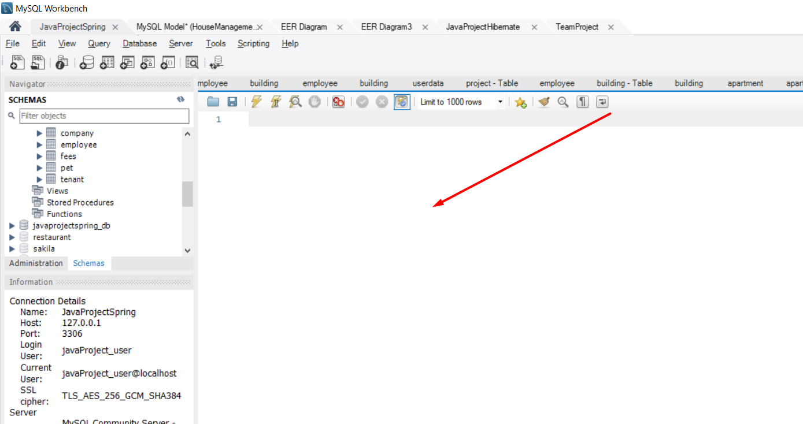

1. Clone or update your project from github
2. change your config file credentials in app.js
mine is:
const dbConfig = {
    host: 'localhost',
    user: 'teamproject_user',
    password: 'teamproject_user',
    database: 'mydb',
};
3. copy the contents of TeamProject.sql and paste them in sql file in MyWorkBench

4. add roles in role table for id's 1,2 and 3
5. Open http://localhost:3000/authentication.html
6. Register and then log in with the Username and Password you have created.
7. if you want to create employees make an entry in the firm table for id 1 as well.
